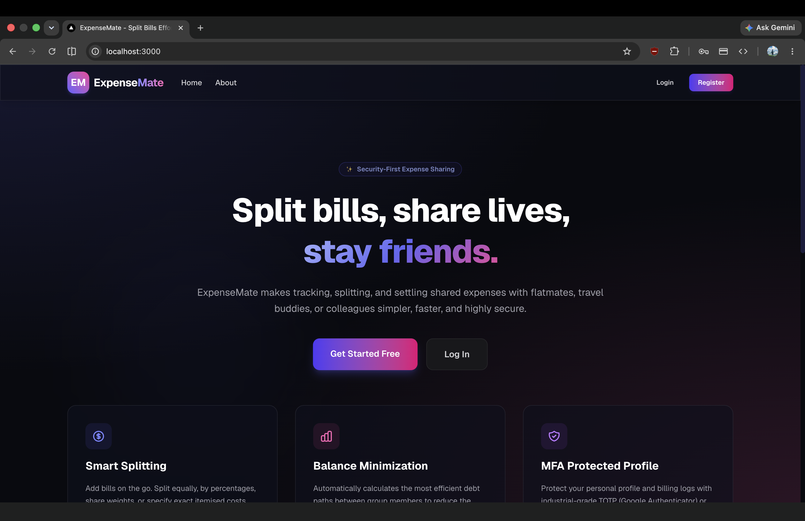
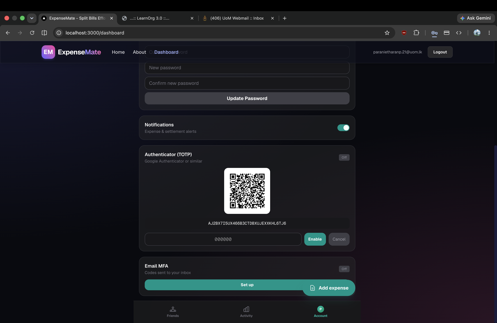
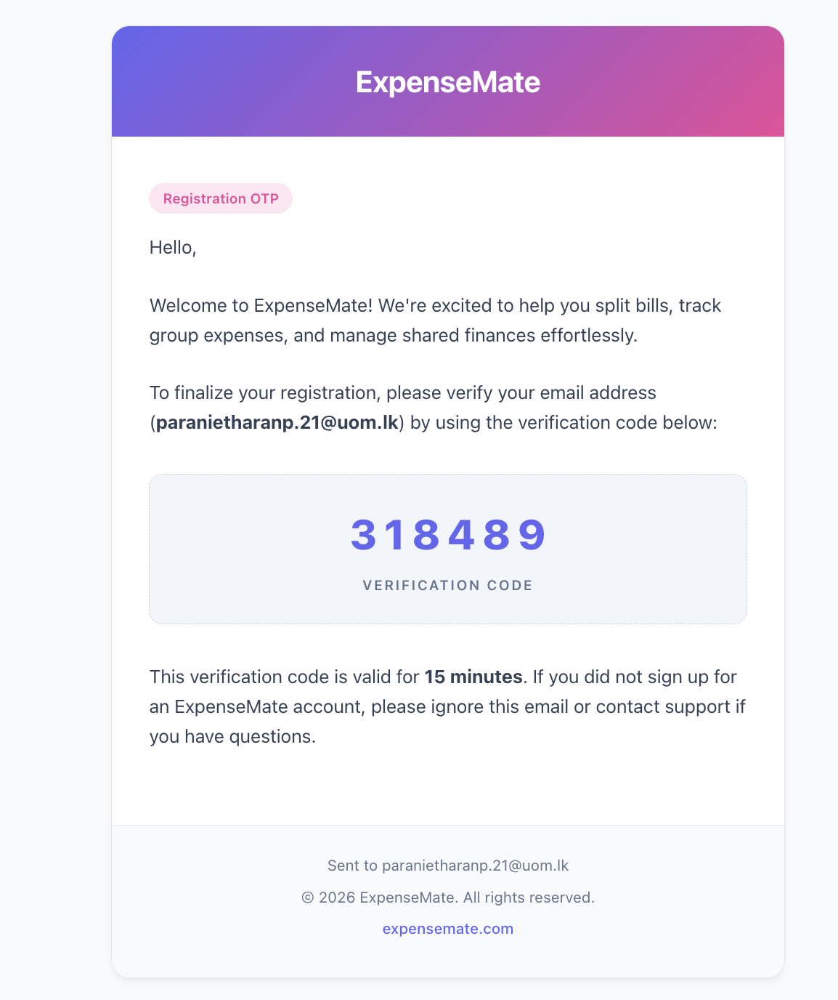
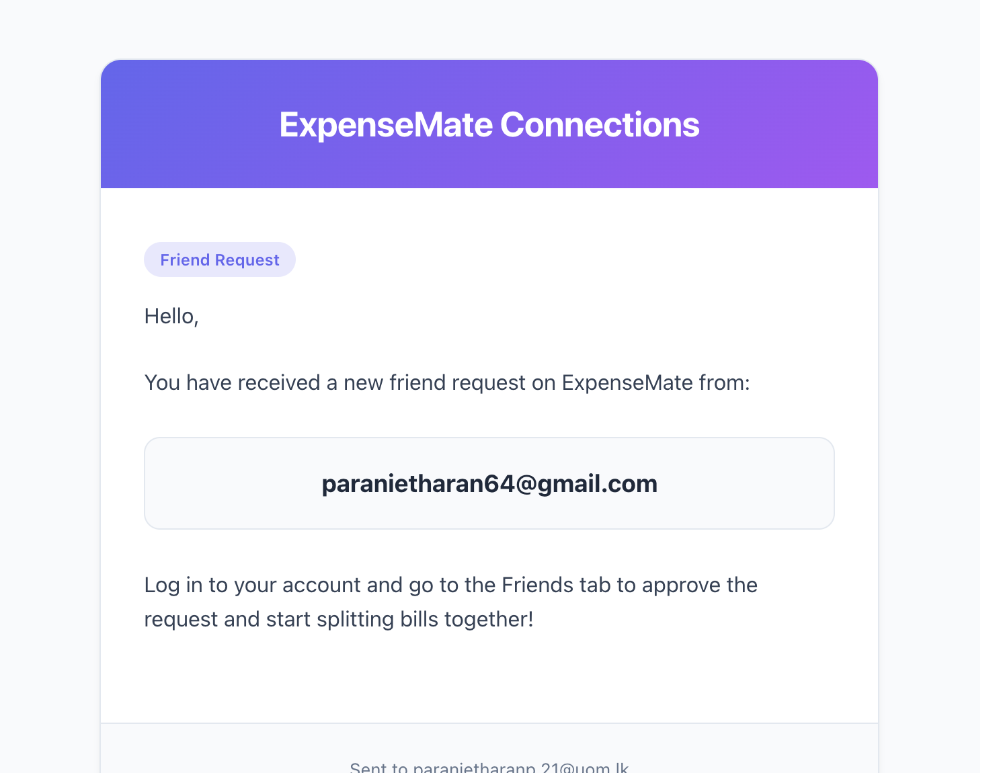

# ExpenseMate

## API Gateway
- Expose all the traffic to the internet
- Validate all the incoming requests

## Auth Service
- Handle Authentication and Authorization

## Expense Service
- Handle Expense Creation
- Split Logic
- Receipt Storage

## Notification Service
- Handle Notifications

# Demo & Screenshots

## Video Walkthrough
Watch the video demonstration of the ExpenseMate features in action:

---

## Screenshots Gallery

### Web Interface

#### Landing & Authentication Page

#### Dashboard & P2P Settle Up (Splitwise Flow)

---

### Email Notifications

#### OTP Security Challenge

#### Real-time Activity Notification
